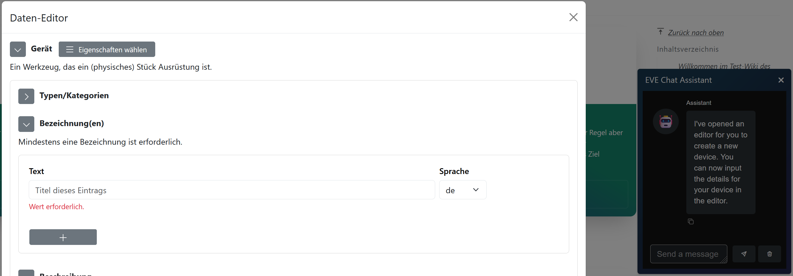

# Chatbot

Embeds an AI chatbot in the wiki per `Special:Chatbot`. 

Legacy support for [h2ogpt](https://github.com/h2oai/h2ogpt) e. g. with [h2ogpt-cpu](https://github.com/OpenSemanticWorld/h2ogpt-cpu-docker-compose).

Never developments build around [osw-chatbot](https://github.com/opensemanticworld/osw-chatbot).

## Features

Chatbot Popup



Legacy:

 * [Special page](https://www.mediawiki.org/wiki/Manual:Special_pages) (specials/SpecialChatbot.php)
 * [Parser hook](https://www.mediawiki.org/wiki/Manual:Parser_functions) (Chatbot/Chatbot.hooks.php)


Usage with [Extension:Iframe](https://github.com/sigbertklinke/Iframe)

in LocalSettings.php
```php
wfLoadExtension( 'Iframe' );
$wgIframe['width'] = "100%";
$wgIframe['server']['chat'] = [ 'scheme' => 'https', 'domain' => '<your_chat_server>' ];
```

On any page
```html
<iframe key="chat" path=""/>
```

## Config

```json
{
    "wgChatbotPopupAssistentConfig": {
        "value": {
            "iframe_src": "https://osw-chatbot.your-domain.com/"
        },
        "description": "Hosting of a compatible chat web app, e.g. 'https://github.com/opensemanticworld/osw-chatbot'"
    }
}
```


## Development

Run a custom instance of [osw-chatbot](https://github.com/opensemanticworld/osw-chatbot)

Navigate to Settings > Chatbot (`Special:Preferences#mw-prefsection-chatbot`)

Set `Custom backend for iframe` to your custom instance server, e.g. `http://localhost:52670/`

