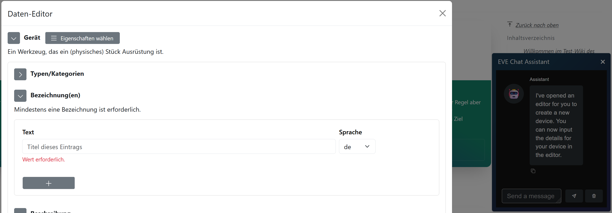

# Chatbot

Embeds an AI chatbot in the wiki per `Special:Chatbot`. 

Legacy support for [h2ogpt](https://github.com/h2oai/h2ogpt) e. g. with [h2ogpt-cpu](https://github.com/OpenSemanticWorld/h2ogpt-cpu-docker-compose).

Never developments build around [osw-chatbot](https://github.com/opensemanticworld/osw-chatbot).

## Features

Chatbot Popup



Legacy:

 * [Special page](https://www.mediawiki.org/wiki/Manual:Special_pages) (specials/SpecialChatbot.php)
 * [Parser hook](https://www.mediawiki.org/wiki/Manual:Parser_functions) (Chatbot/Chatbot.hooks.php)


Usage with [Extension:Iframe](https://github.com/sigbertklinke/Iframe)

in LocalSettings.php
```php
wfLoadExtension( 'Iframe' );
$wgIframe['width'] = "100%";
$wgIframe['server']['chat'] = [ 'scheme' => 'https', 'domain' => '<your_chat_server>' ];
```

On any page
```html
<iframe key="chat" path=""/>
```

## Config

In `LocalSettings.php`:

```php
wfLoadExtension( 'Chatbot' );

// Url of the chat backend to embed. `panel serve` publishes the app under the
// name of its script, hence the /main suffix.
$wgChatbotPopupAssistentConfig = [
    'iframe_src' => 'https://osw-chatbot.your-domain.com/main',
    'confirm_redirect' => true,   // ask before the assistant navigates away
];

// Shared with the backend (CHATBOT_SHARED_SECRET there). Enables the signed
// per-user token described below. Leave empty to run the backend open.
$wgChatbotSecret = '';           // e.g. bin2hex(random_bytes(32))
$wgChatbotTokenTtl = 43200;      // seconds

// Origins a user may enter in the "Custom backend for iframe" preference.
// Empty (the default) hides that preference entirely - see Development.
$wgChatbotAllowedBackendOrigins = [];
```

## How it talks to the backend

The backend runs in a **cross-origin iframe**, so everything goes over
`postMessage`. Both sides validate `event.origin` *and* `event.source`; without
that, any page able to reach the window could make the wiki run the tool
functions below with the logged-in user's session.

**Client-side tools.** The backend asks the wiki to execute a function
(`where_am_i`, `get_page_content`, `smw_ask_query`, `get_file_data_url`,
`redirect`, …) and the wiki replies with the result. These run in the user's own
browser, so they are bounded by that user's MediaWiki permissions - the backend
never acts on the user's behalf, it only asks the browser to.

**Storage delegation.** The backend cannot rely on its own `localStorage`
(third-party storage is partitioned in Chrome/Firefox and blocked under Safari
ITP), so it asks the wiki to store the chat history for it, via
`chatbot_storage_get` / `_set` / `_remove`. The **wiki** builds the key -
`osw-chatbot:<wgDBname>:<user>:<key>` - and rejects anything outside that
namespace, which is what keeps one user's history away from another's.

**Identity.** `action=chatbottoken` issues a short lived token
`base64url(json{u,w,iat,exp,n}).base64url(hmac_sha256)` signed with
`$wgChatbotSecret`; `chatbot.js` appends it to the iframe url and the backend
verifies it. It is an API module rather than a `mw.config` var so that a
per-user secret never lands in cached page output. Anonymous readers are issued
a token for the user `anon`.

## Development

Run a custom instance of [osw-chatbot](https://github.com/opensemanticworld/osw-chatbot)

Allow its origin in `LocalSettings.php` - **without this the preference below is
not shown and any previously saved value is ignored**, because it hands the
whole tool-call channel (page content, file downloads, redirects) to whatever
origin is entered:

```php
$wgChatbotAllowedBackendOrigins = [ 'http://localhost:52670' ];
```

Navigate to Settings > Chatbot (`Special:Preferences#mw-prefsection-chatbot`)

Set `Custom backend for iframe` to your custom instance server, e.g. `http://localhost:52670/main`

The backend also has to accept this wiki as a parent (`PARENT_ORIGIN`) and as a
websocket origin (`BOKEH_ALLOW_WS_ORIGIN`); see the osw-chatbot README.

